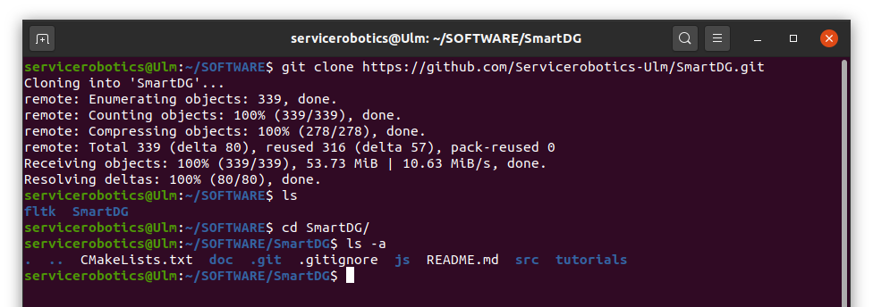
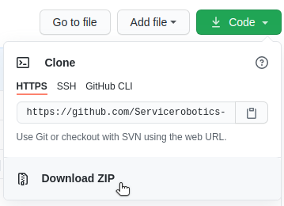
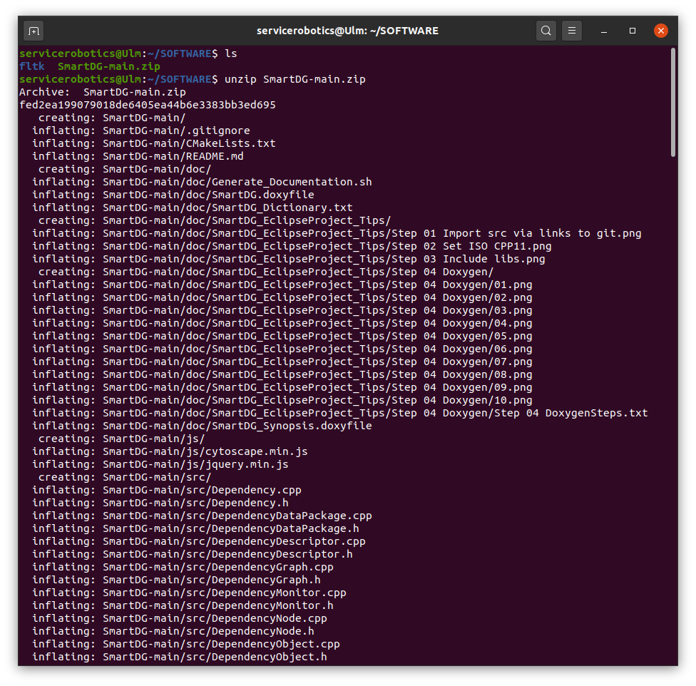
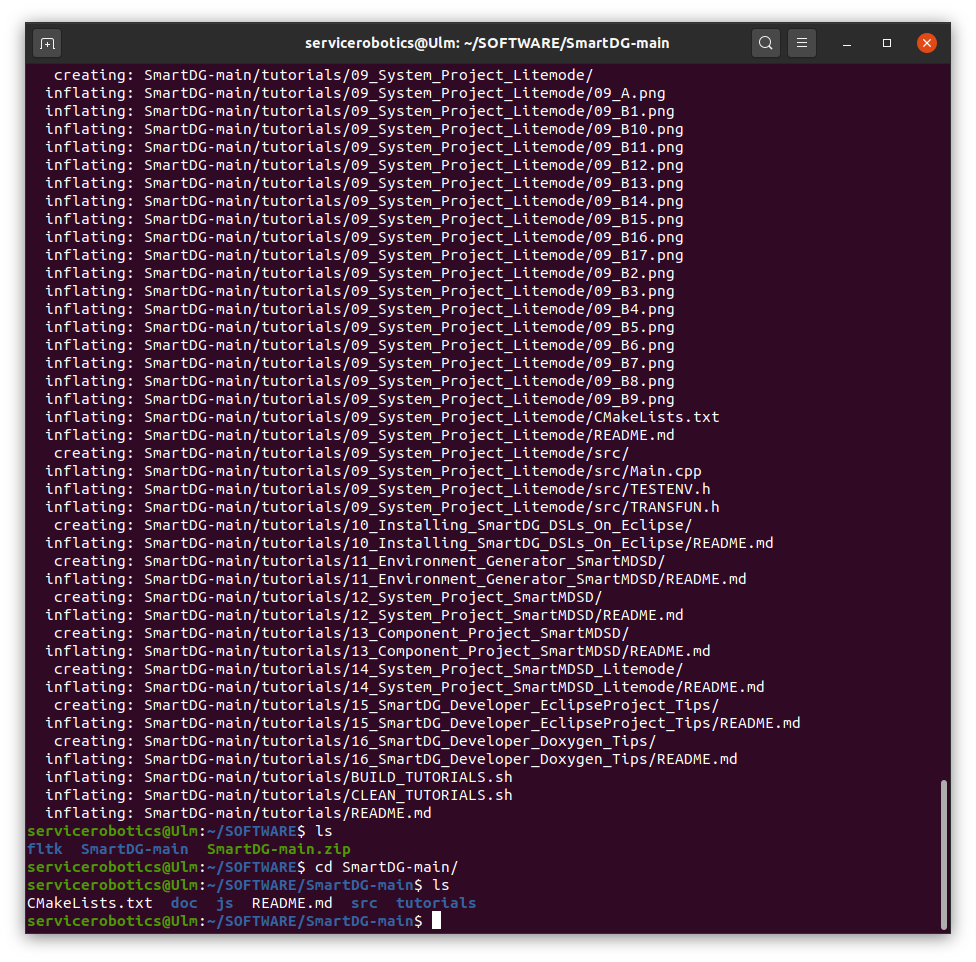
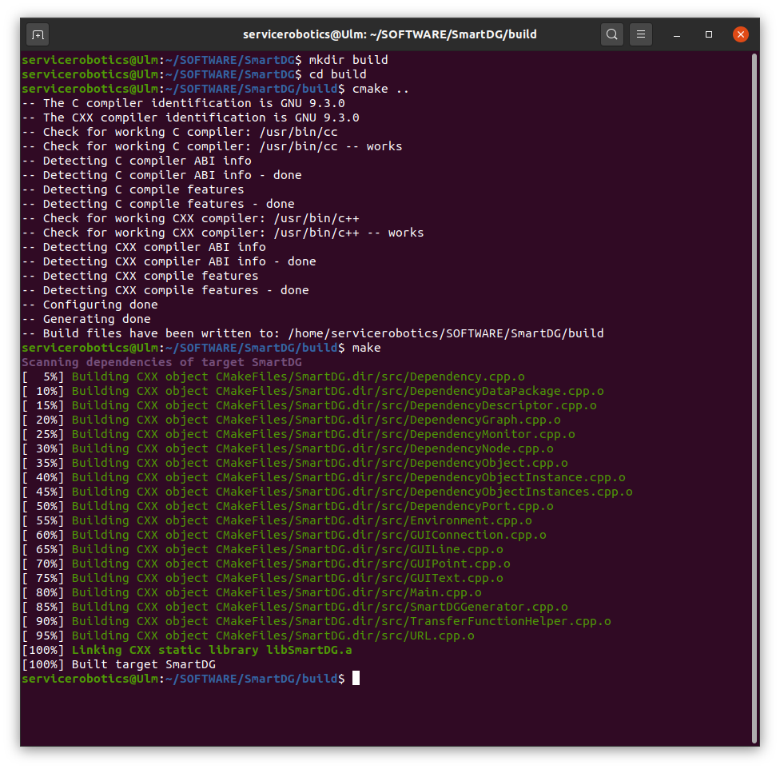
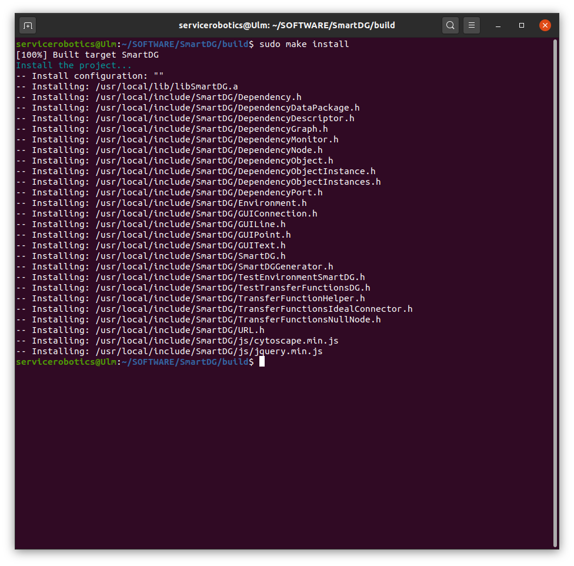

# SmartDG Tutorials
## Installing SmartDG Library

### Downloading SmartDG Library
You can download the library in one of the following two ways.
* Cloning the SmartDG Library for development
```bash
git clone https://github.com/Servicerobotics-Ulm/SmartDG.git
```


* Downloading the SmartDG Library archive.


```bash 
unzip SmartDG-main.zip
```



### Building and installing SmartDG Library
```bash
mkdir build
cd build
cmake ..
make
sudo make install
```



### Optional : Generate documentation
Run "Generate_Documentation.sh" script in "doc" folder of SmartDG Library.

:information_source: [See Tutorial](../99_02_SmartDG_Developer_Doxygen_Tips/README.md)

### Optional : Import tutorials
Run "FETCH_TUTORIALS.sh" script in "tutorials" folder of SmartDG Library.

:information_source: Watch video "FETCH_TUTORIALS.mp4" in "tutorials" folder of SmartDG Library.

### Optional : Import examples
Run "FETCH_EXAMPLES.sh" script in "tutorials" folder of SmartDG Library.

:information_source: Watch video "FETCH_EXAMPLES.mp4" in "tutorials" folder of SmartDG Library.

