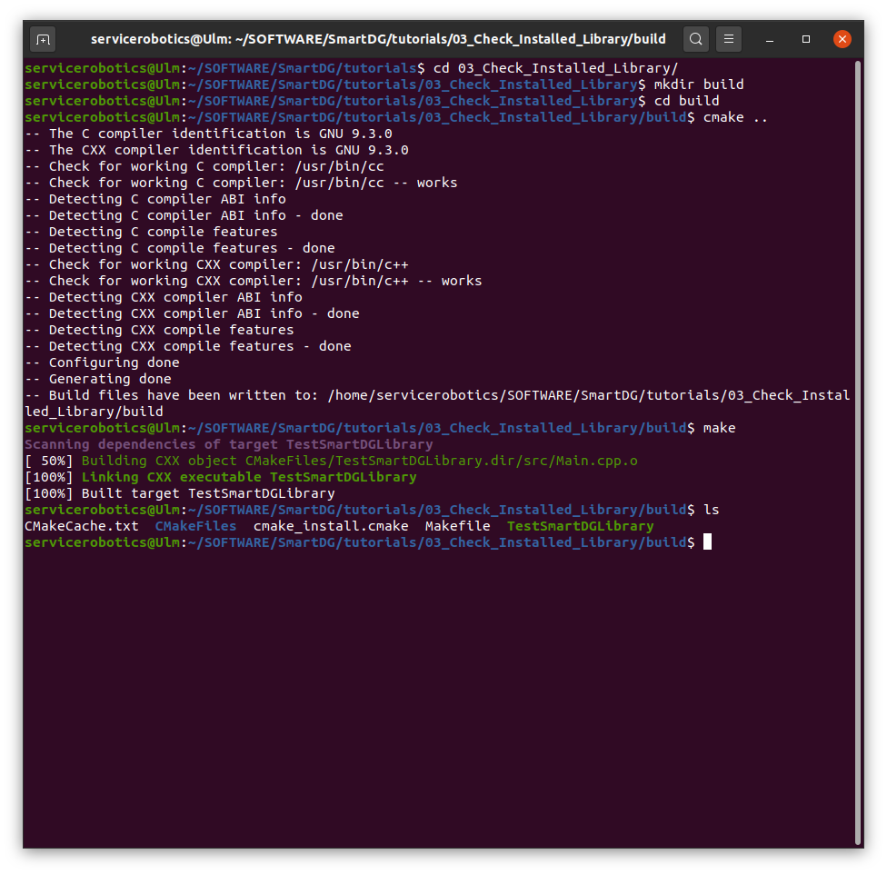
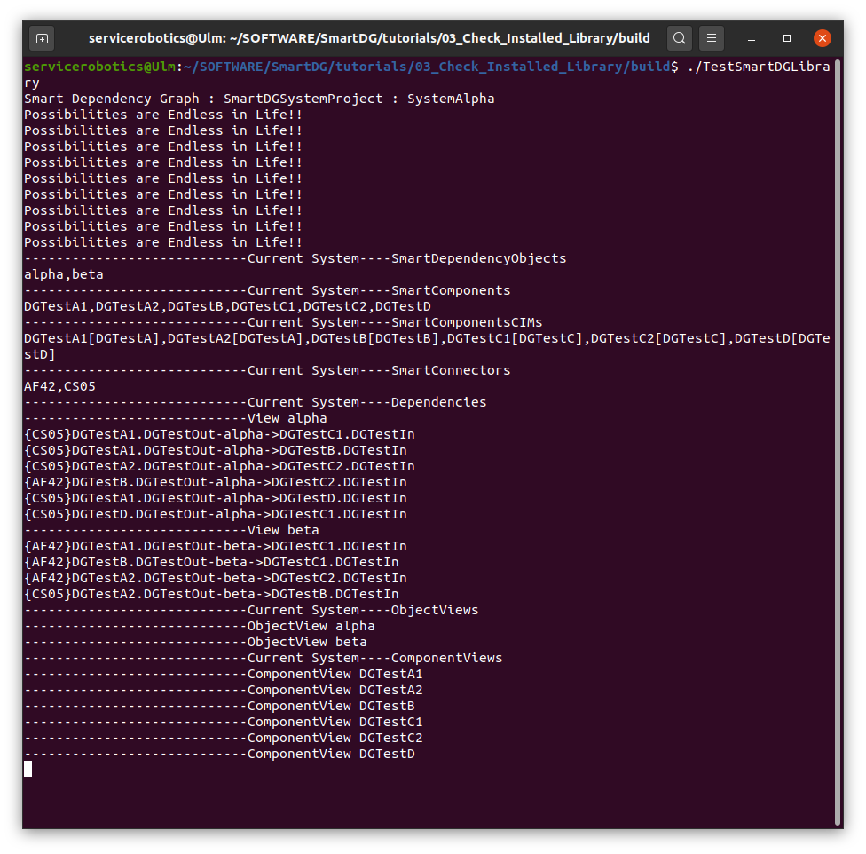
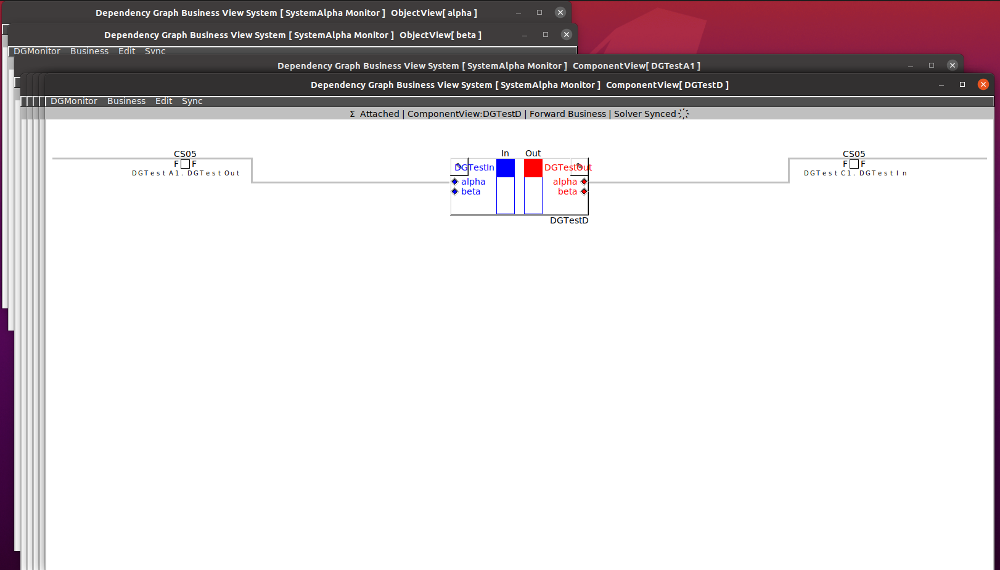
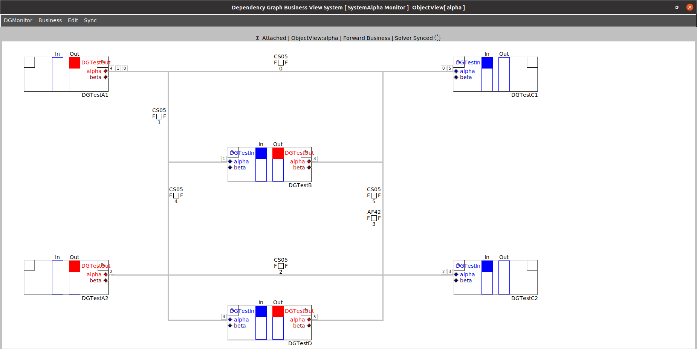

# SmartDG Tutorials
## Check Installed Library

### Build "Check Installed Library" tutorial

```bash
cd tutorials/03_Check_Installed_Library/
mkdir build
cd build
cmake ..
make
```



### Run "Check Installed Library" tutorial

```bash
./TestSmartDGLibrary
```




