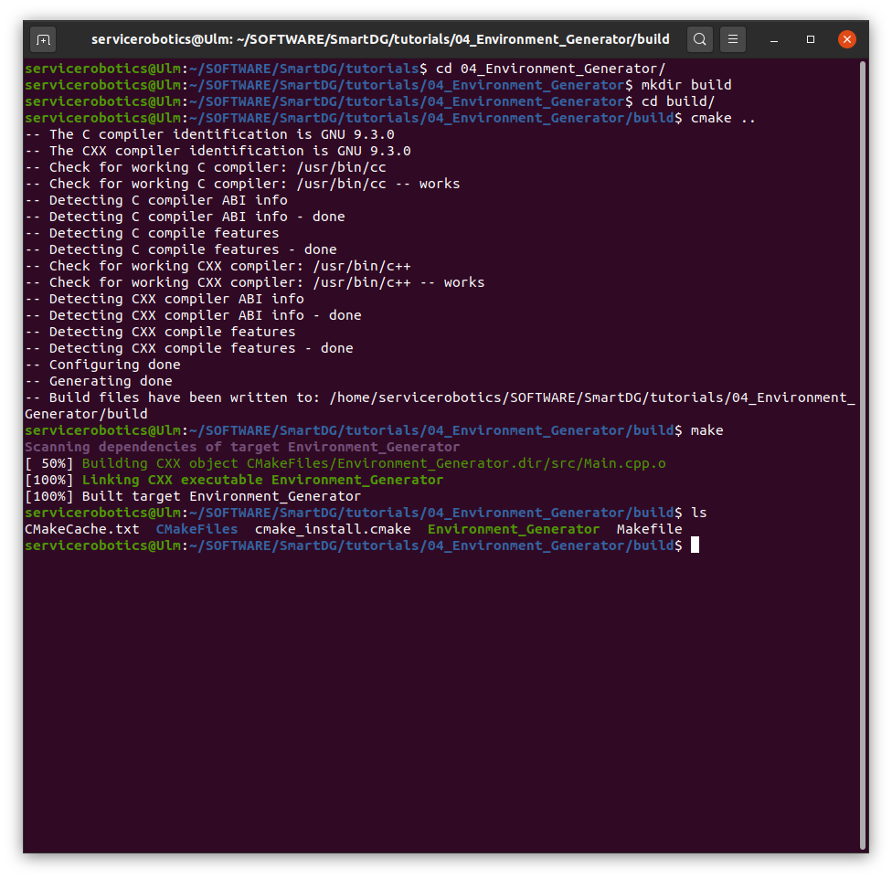
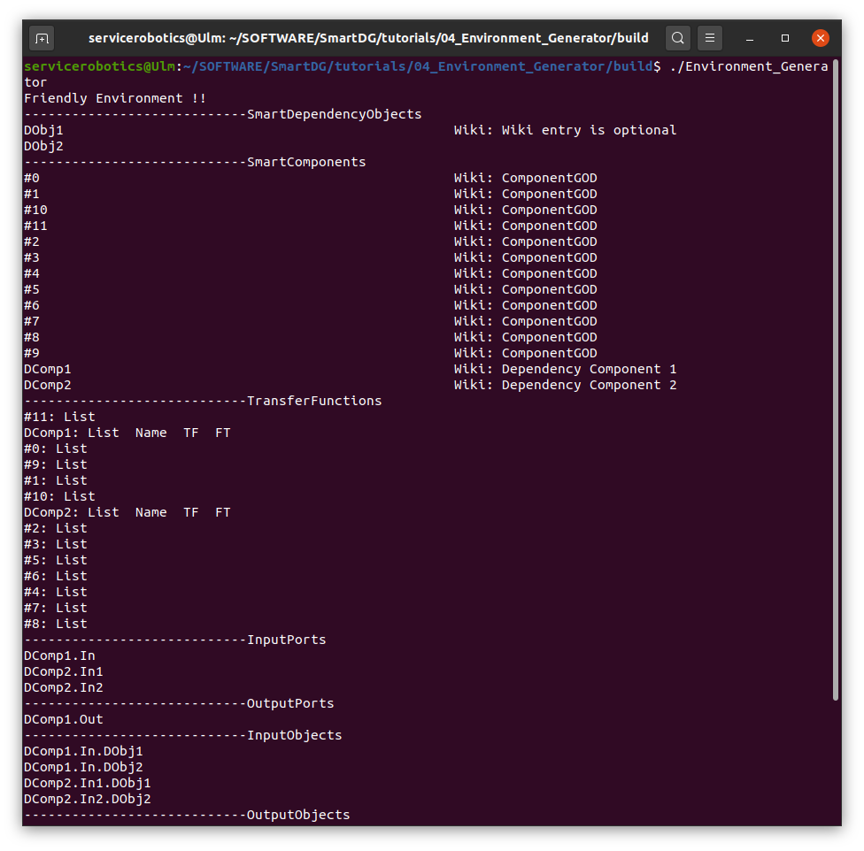
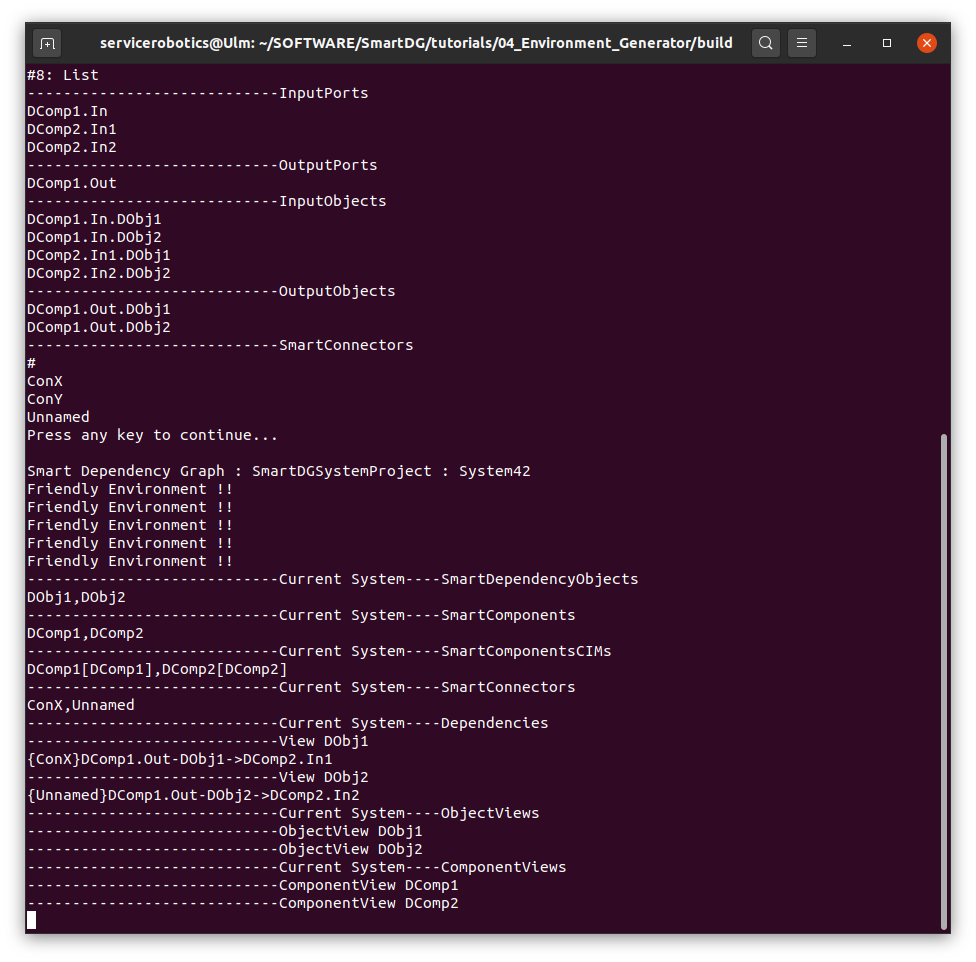
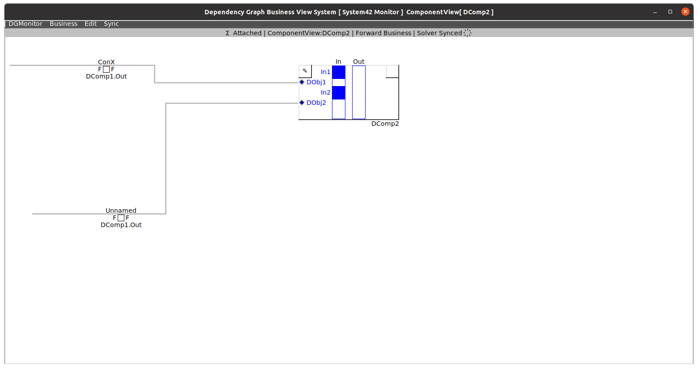
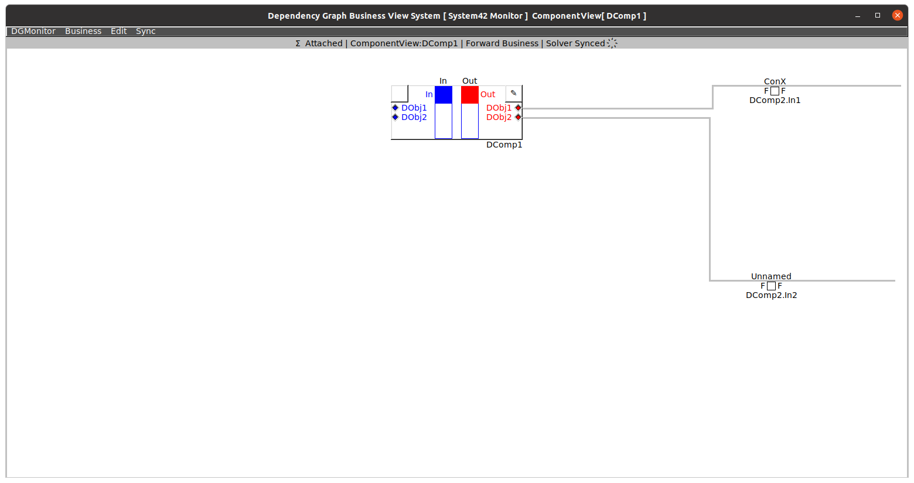
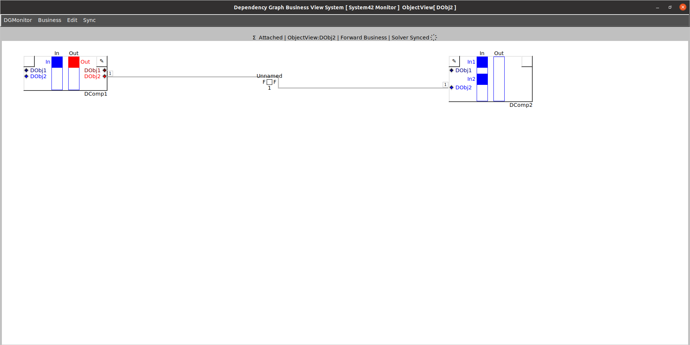
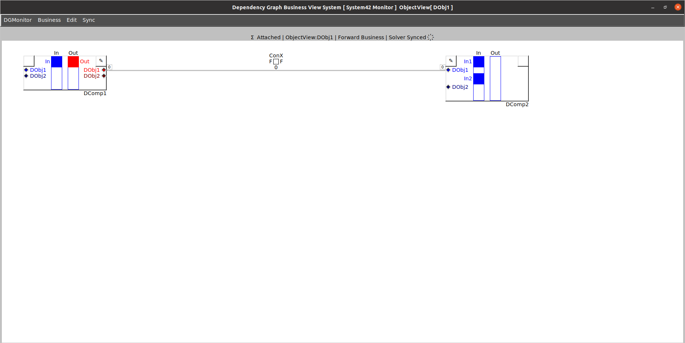

# SmartDG Tutorials
## Environment Generator

### Build "Environment Generator" tutorial

```bash
cd tutorials/01_04_Environment_Generator/
mkdir build
cd build
cmake ..
make
```



### Run "Environment Generator" tutorial

```bash
./Environment_Generator
```







