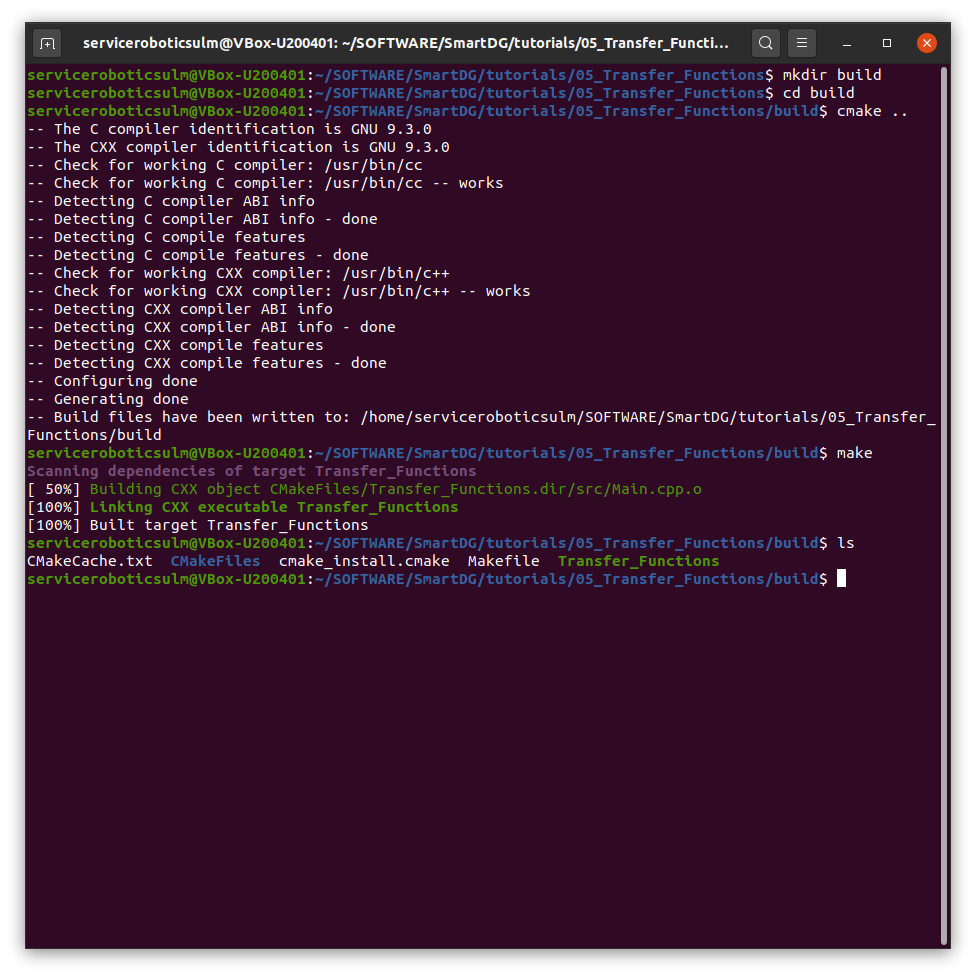
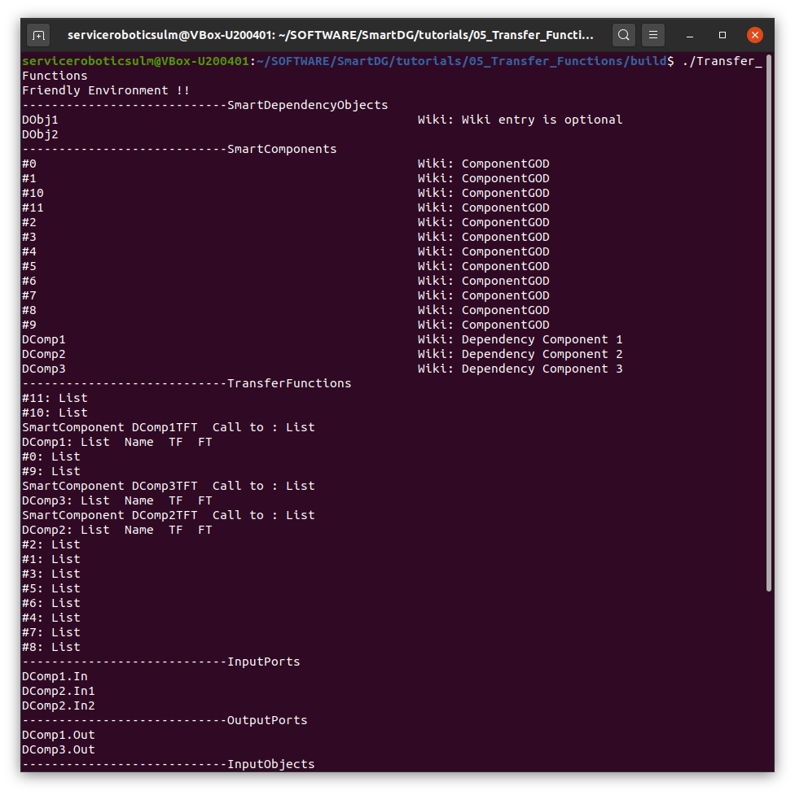
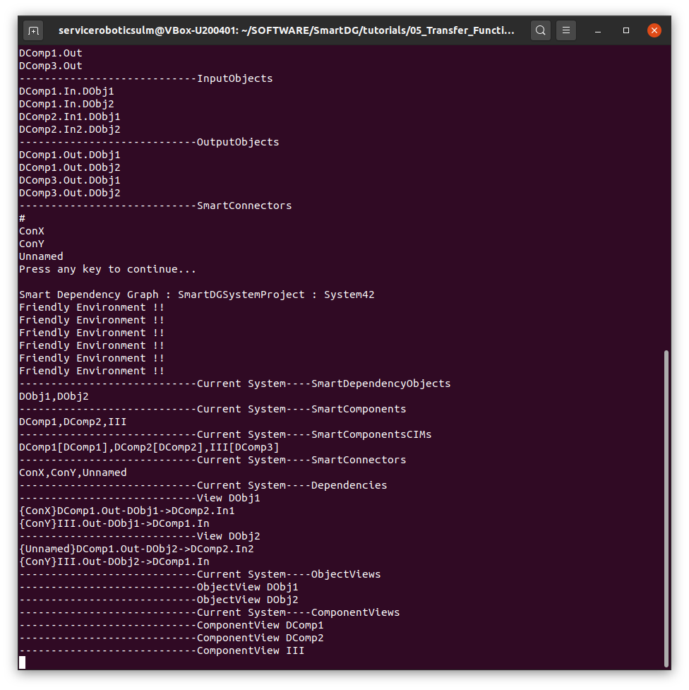
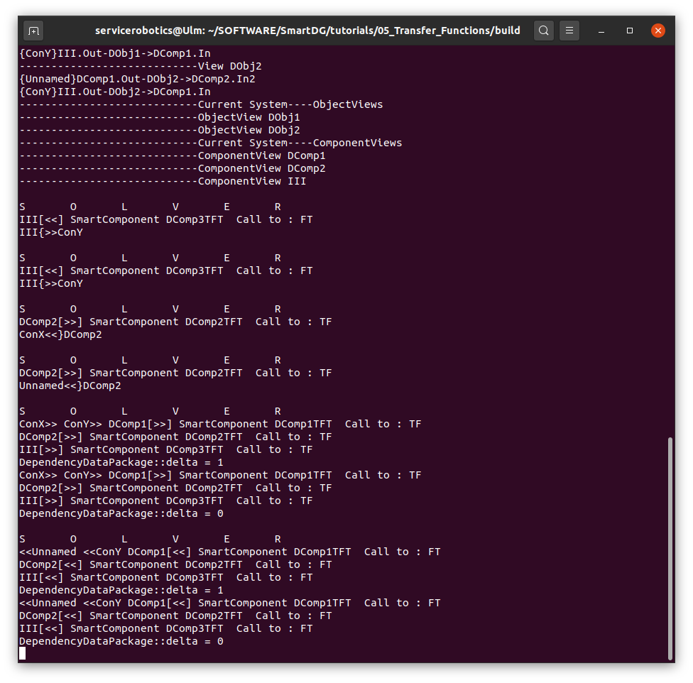

# SmartDG Tutorials
## Transfer Functions

### Build "Transfer Functions" tutorial

```bash
cd tutorials/01_05_Transfer_Functions/
mkdir build
cd build
cmake ..
make
```



### Run "Transfer Functions" tutorial

```bash
./Transfer_Functions
```





### "Transfer Functions" in action



:information_source: Watch video [Forward Business Call in ComponentView](Transfer_Functions_C1_ForwardCall_ComponentView.mp4)

:information_source: Watch video [Reverse Business Call in ComponentView](Transfer_Functions_C2_ReverseCall_ComponentView.mp4)

:information_source: Watch video [Attached Sync Download to ComponentView](Transfer_Functions_C3_SyncDownload_ToComponentView.mp4)

:information_source: Watch video [Attached Sync Download to Dependency Object View](Transfer_Functions_C4_SyncDownload_ToDObjView.mp4)

:information_source: Watch video [Solver calling Forward and Reverse Transfer Functions](Transfer_Functions_C5_Solver.mp4)

