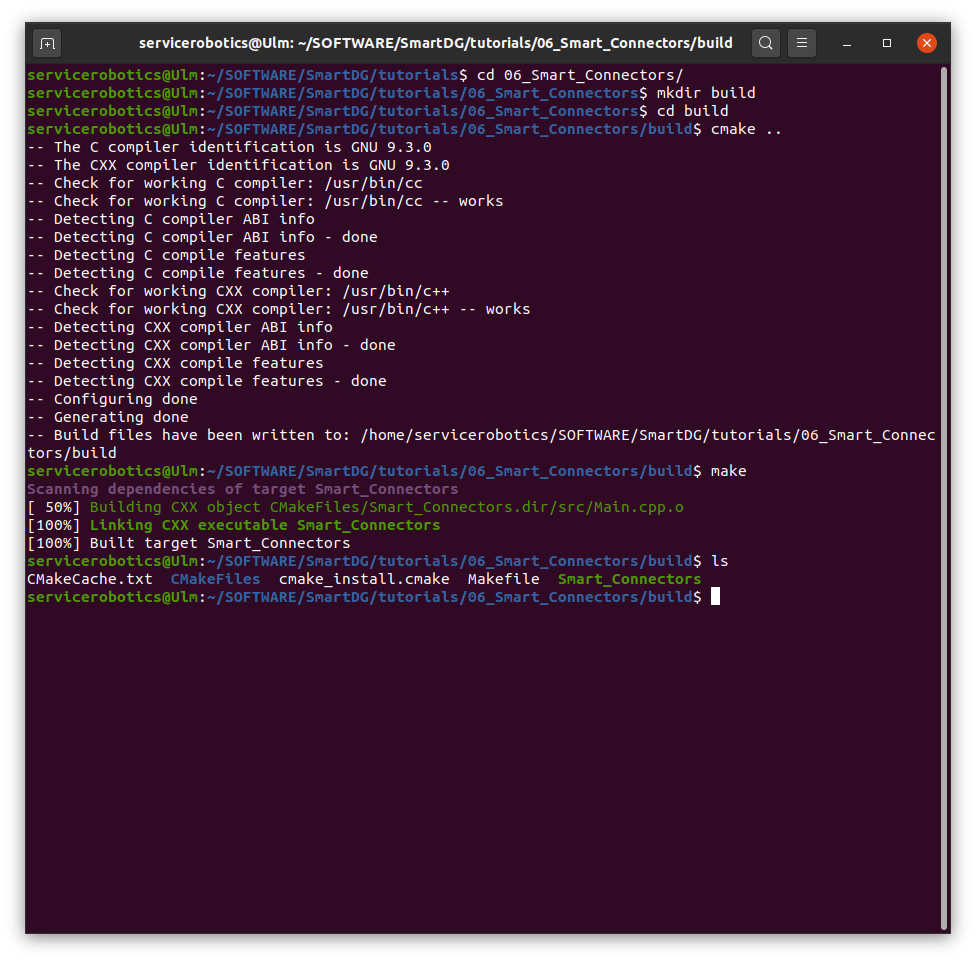
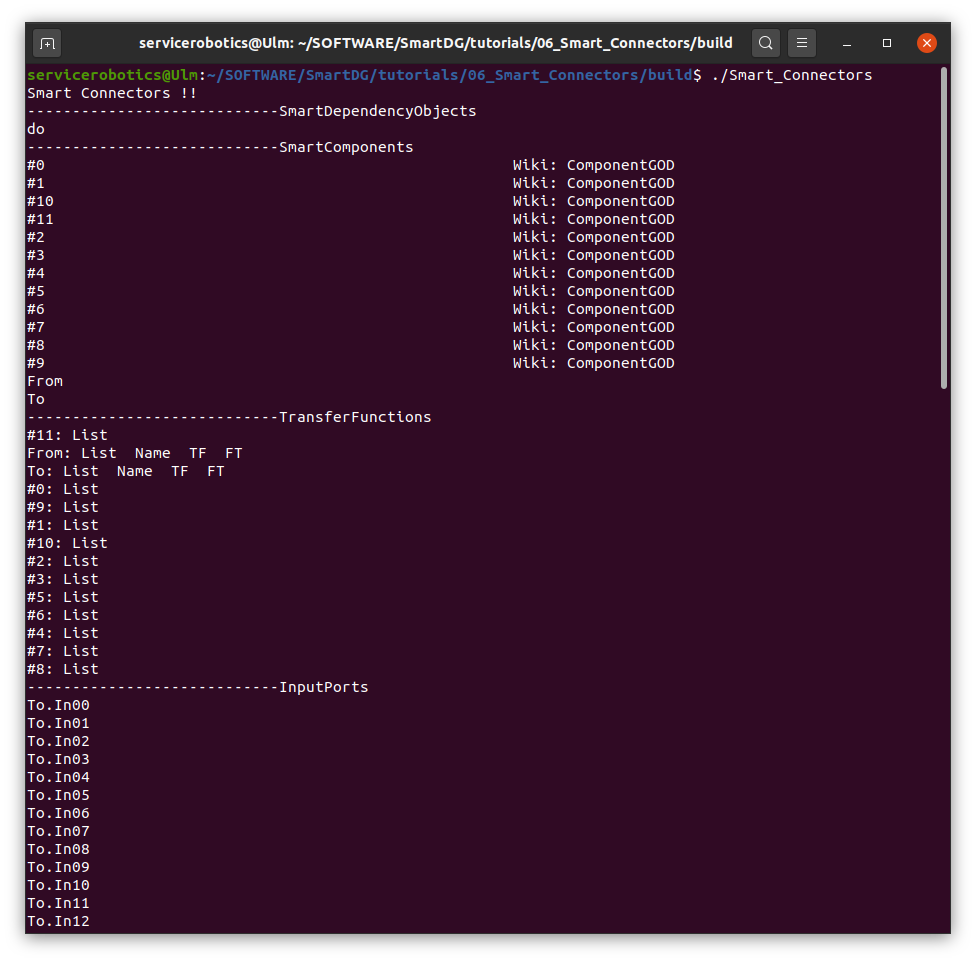
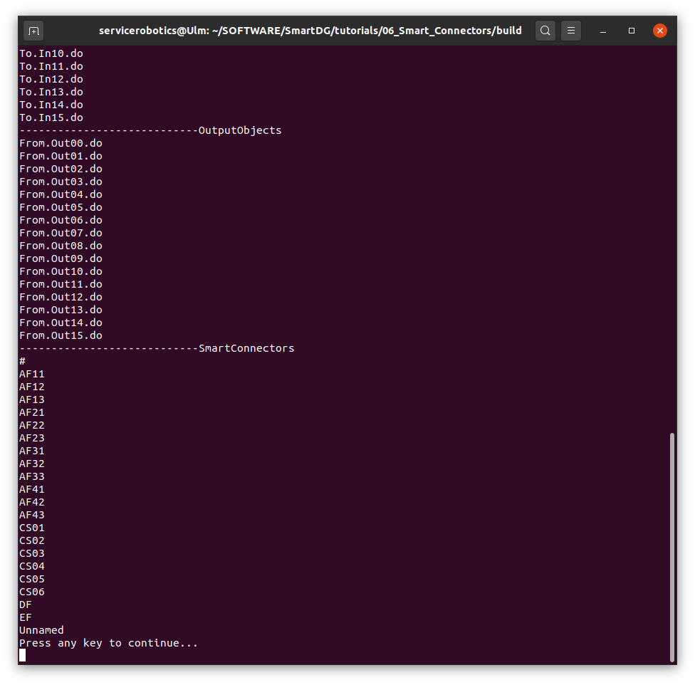
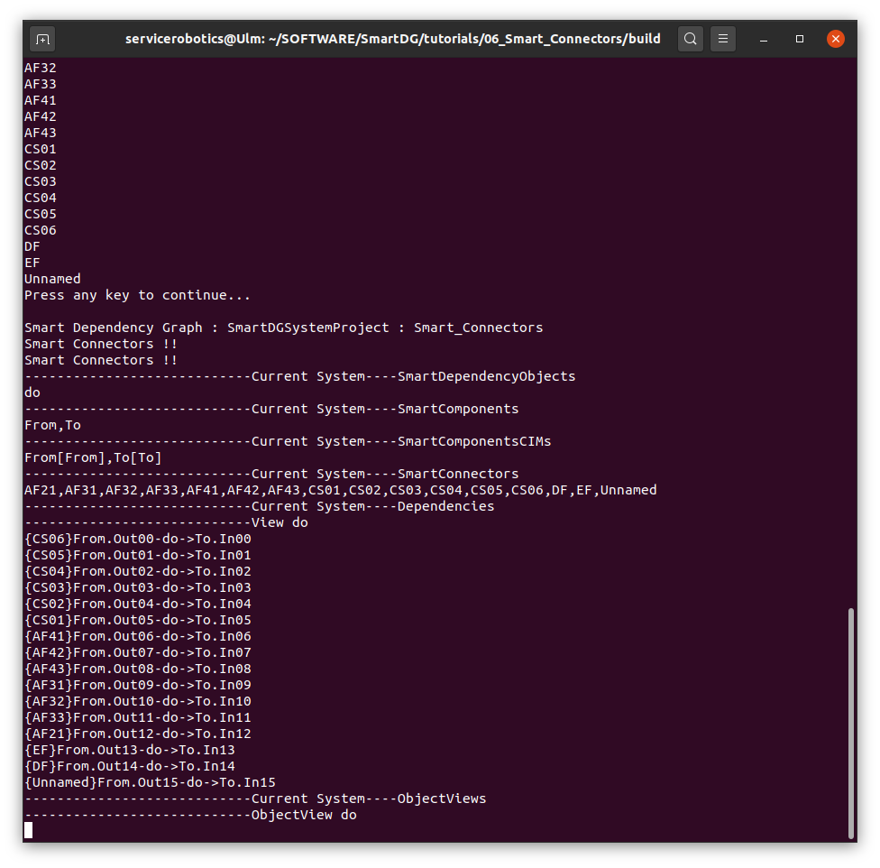
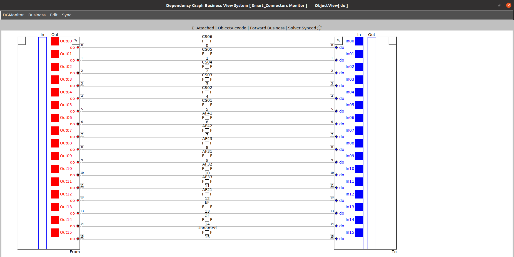

# SmartDG Tutorials
## Smart Connectors

### Build "Smart Connectors" tutorial

```bash
cd tutorials/01_06_Smart_Connectors/
mkdir build
cd build
cmake ..
make
```



### Run "Smart Connectors" tutorial

```bash
./Smart_Connectors
```






