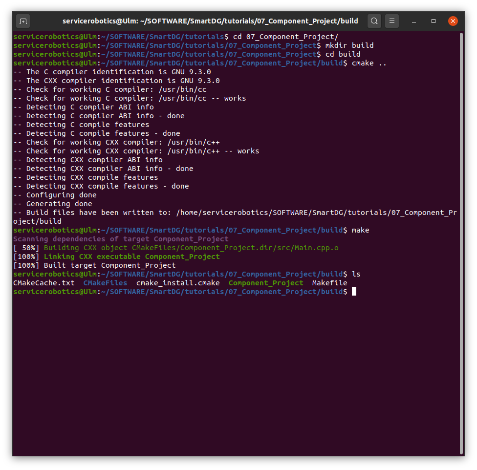
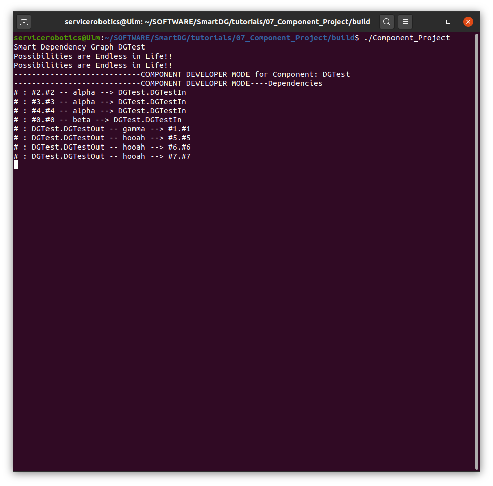
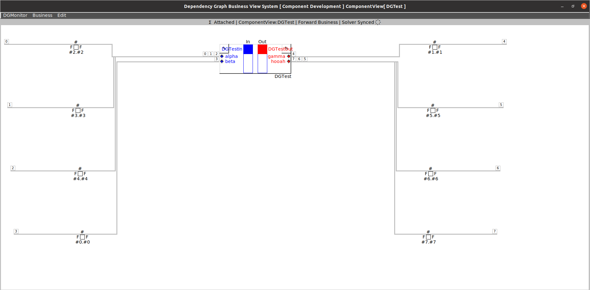
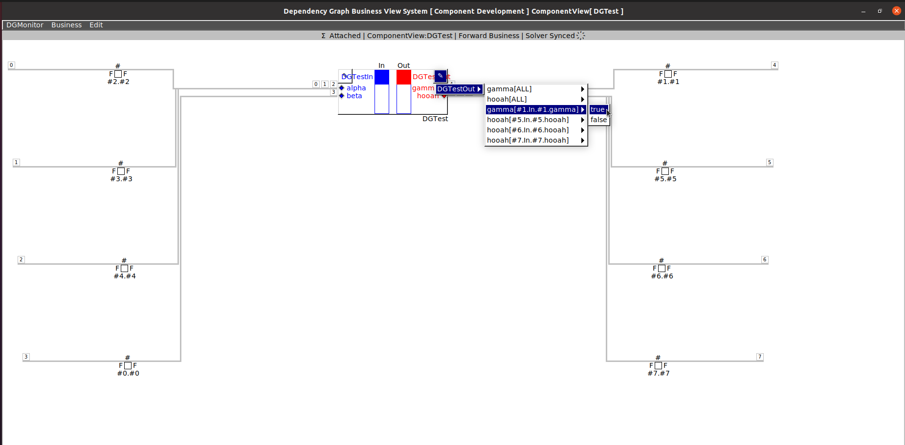
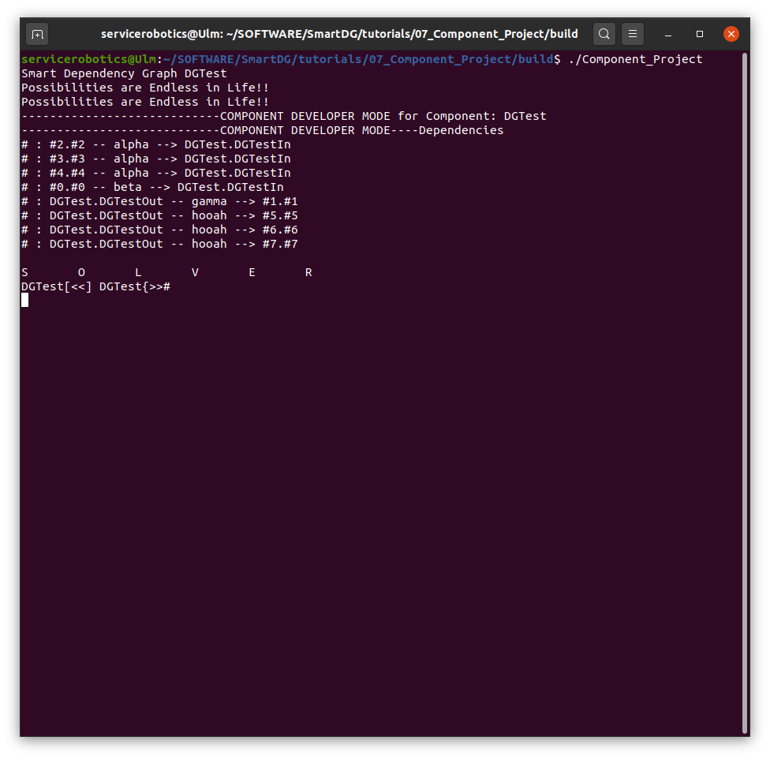

# SmartDG Tutorials
## Component Project

### Build "Component Project" tutorial

```bash
cd tutorials/01_07_Component_Project/
mkdir build
cd build
cmake ..
make
```



### Run "Component Project" tutorial

```bash
./Component_Project
```







