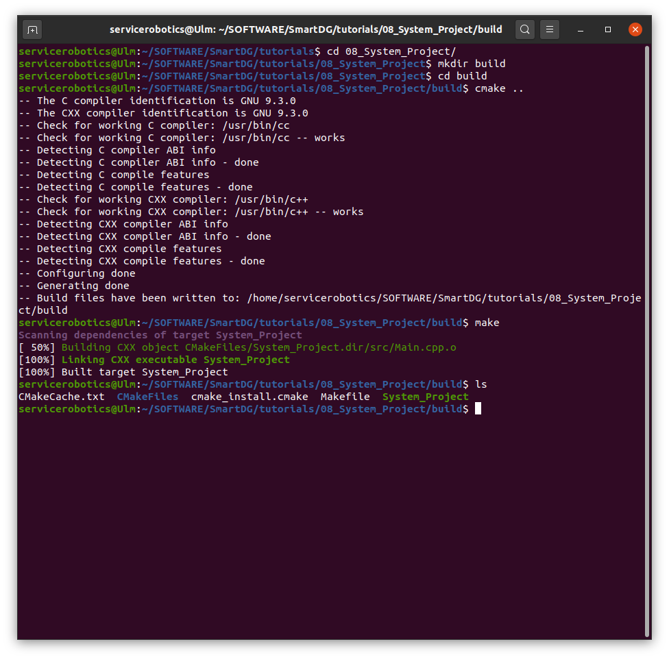
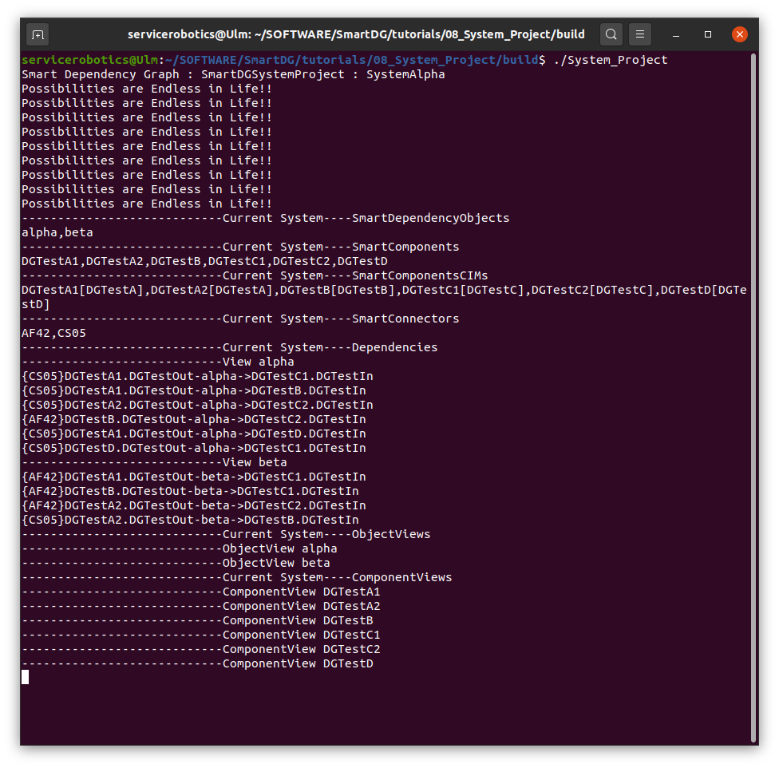

# SmartDG Tutorials
## System Project

### Build "System Project" tutorial

```bash
cd tutorials/01_08_System_Project/
mkdir build
cd build
cmake ..
make
```



### Run "System Project" tutorial

```bash
./System_Project
```



:information_source: Watch video [System Project](System_Project_B2.mp4)


### "System Project" in action

## Exploring Monitor Menu

:information_source: Watch video [DG Monitor Menu](System_Project_C1_DGMonitorMenu.mp4)

## Exploring Business Menu

:information_source: Watch video [DG Business Menu](System_Project_C2_BusinessMenu.mp4)

## Exploring Edit Menu

:information_source: Watch video [DG Edit Menu](System_Project_C3_EditMenu.mp4)

## Exploring Sync Menu

Attach or detach a view to observe cumulative or standalone actions of transfer/inverse transfer functions.

:information_source: Watch video [DG Sync Menu | Attach Detach](System_Project_C4_SyncMenu_Detach.mp4)

When Solver Sync is turned off, changes made by a Solver run remains within the view. These changes can be negated by downloading global data again. To apply these changes to the global data, use Upload option.

:information_source: Watch video [DG Sync Menu | Solver Sync](System_Project_C5_SyncMenu_SolverSync.mp4)

