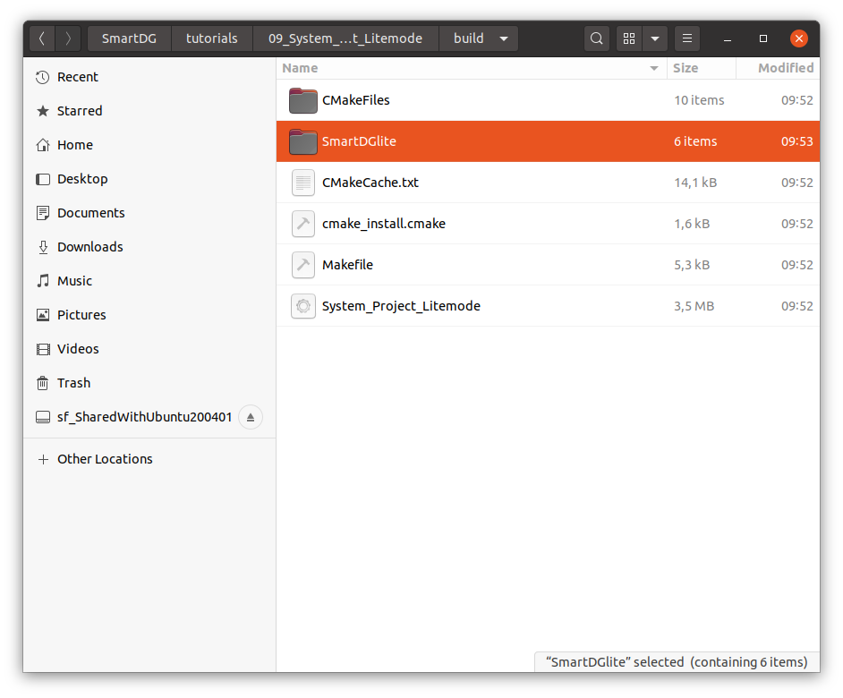

# SmartDG Tutorials
## Smart Connectors

### Build "System_Project_Litemode" tutorial

```bash
cd tutorials/01_09_System_Project_Litemode/
mkdir build
cd build
cmake ..
make
```


### Run "System Project Litemode" tutorial

#### Launch SmartDG execution file

```bash
./Smart_Connectors
```


#### Find the newly generated SmartDGlite folder in the build directory



#### SmartDGlite folder contents


#### In SmartDGlite folder, launch the Script named "LaunchServer.sh"


#### Automatic opening of the following browser window indicates a successful launch of the data sync server.


#### In SmartDGlite folder, find and open the file named "DGlite.html". This opens the multi-view SmartDGlite GUI.


#### An animated "Live" dot indicates that the "SmartDG Lite Mode" is synced with the General SmartDG system execution model.


#### All Dependency objects are set false (Red) by default. A true state is represented by (Green).
"SmartDG Lite Mode" provides greater functionality in terms of handling and observing the components and individual dependency links.


#### Changes made in any of the General SmartDG component or dependency object views are reflected immediately in "SmartDG Lite Mode".


#### Solvers are triggered on every change in value for any of the Dependency Object instances.


#### Changes made in any of the Dependency Object view...


#### Or in any of the component views...


#### Immediately appear in the SmartDGlite multi-view GUI.


#### Several calls to Transfer and Inverse Transfer Functions through several calls to Solver.


#### On exiting the SmartDG execution program...


## Do not forget to exit from the data sync server running in the other window (Control + C).


:information_source: Watch video [System Project Litemode](System_Project_Litemode_C.mp4)

