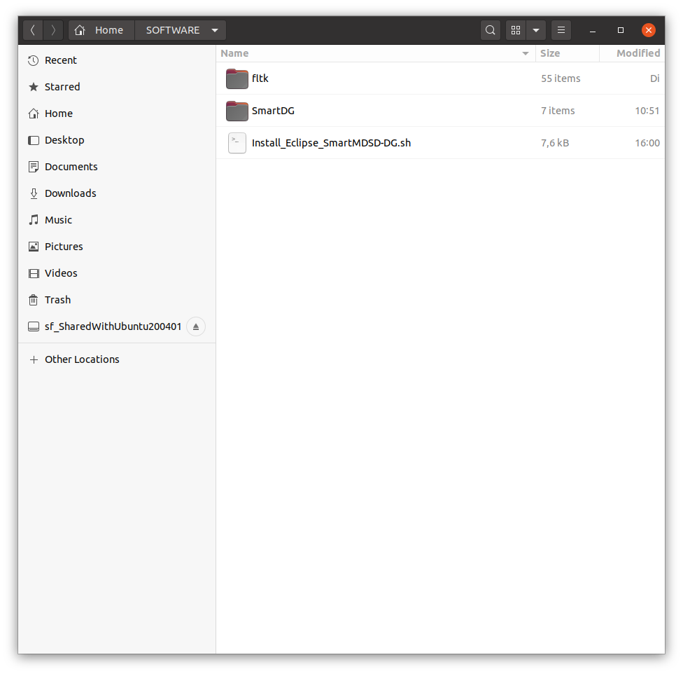
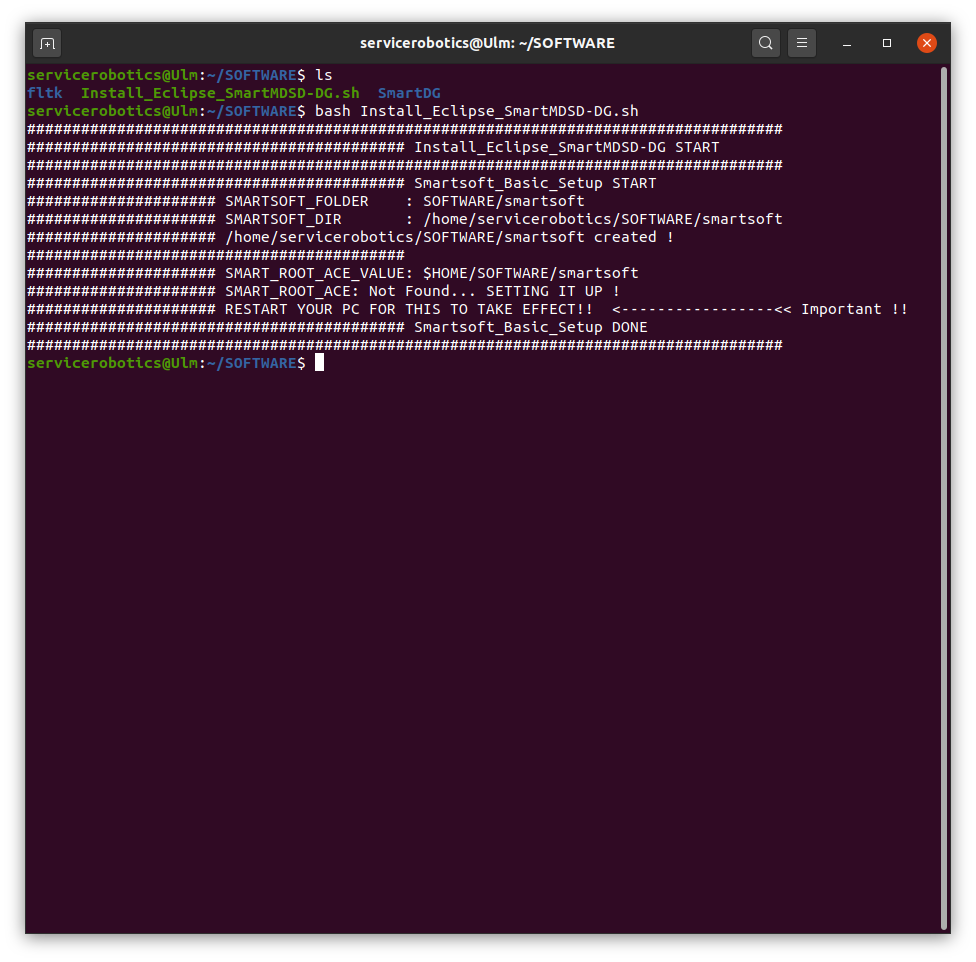
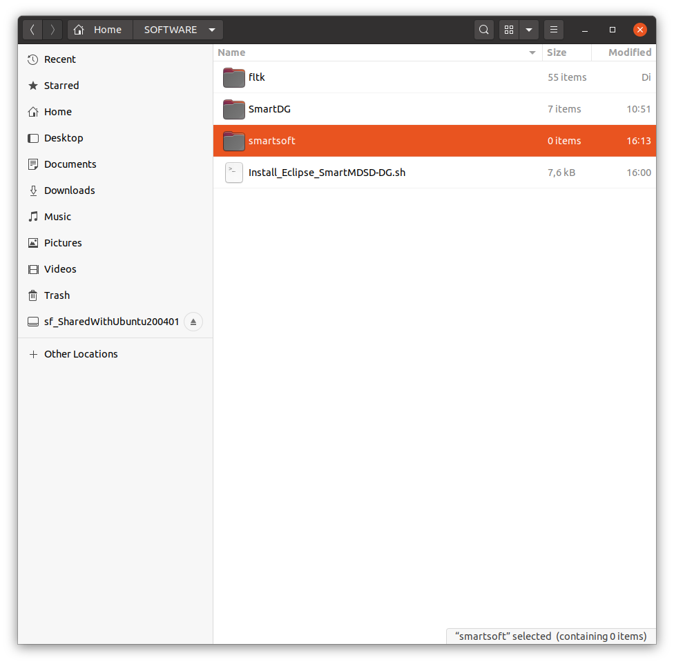
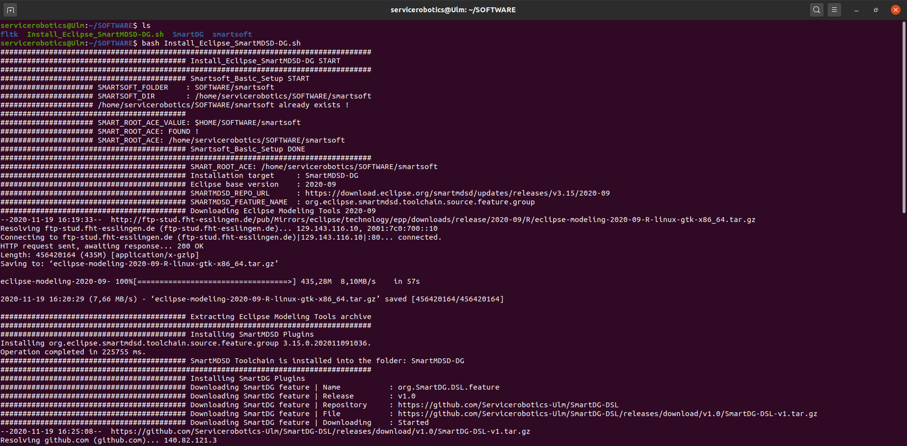
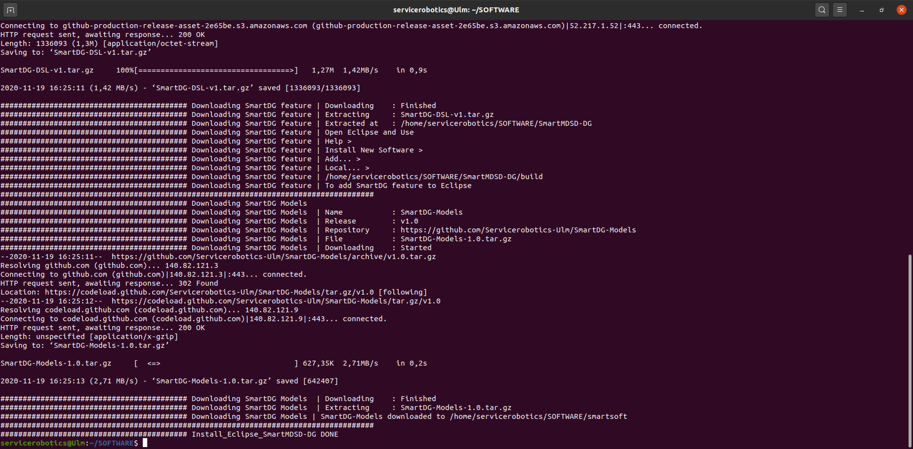
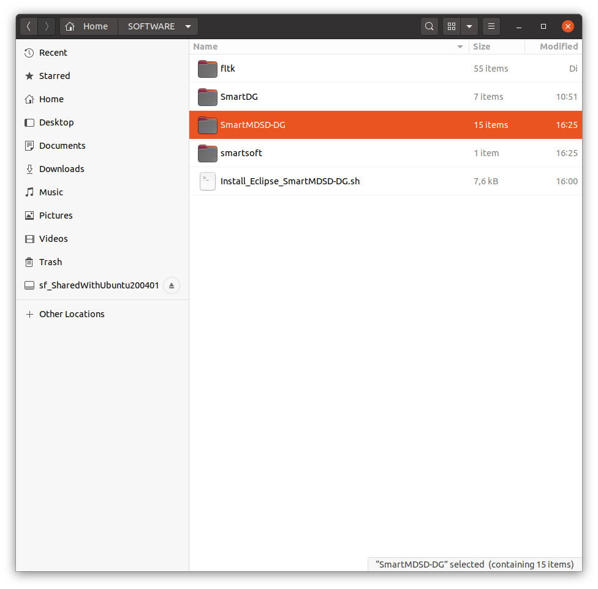
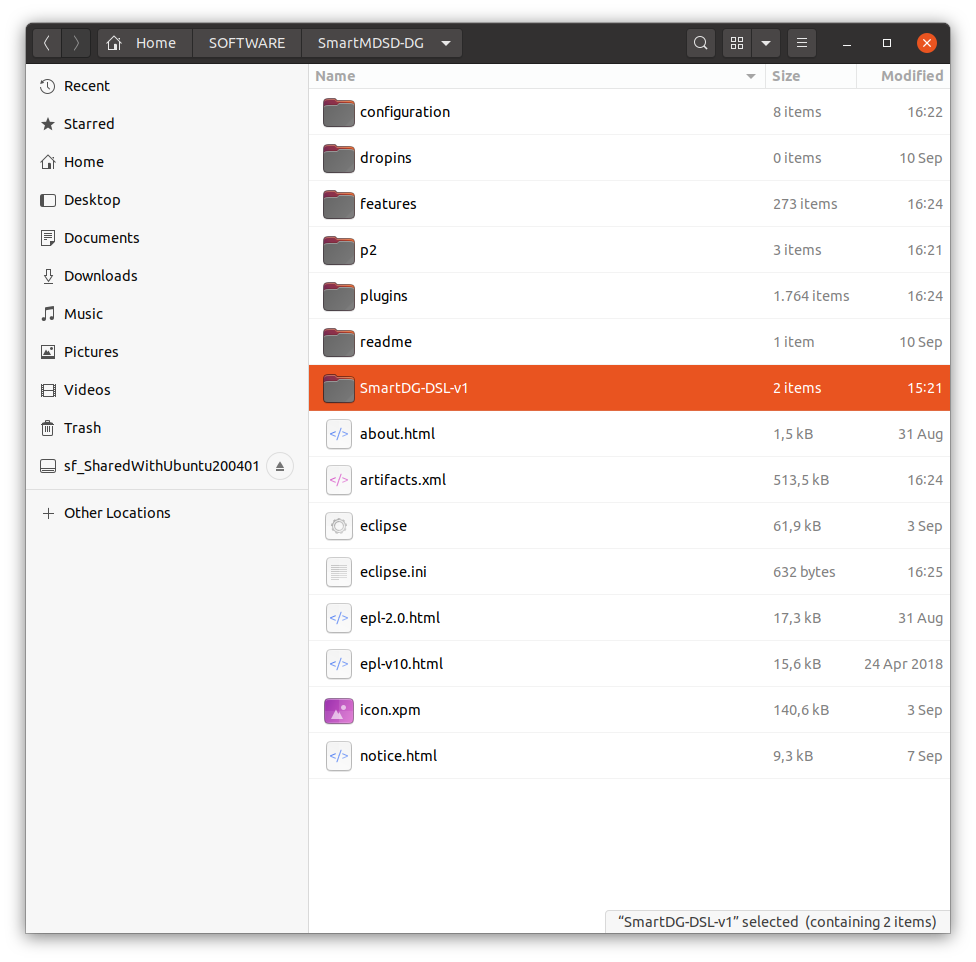
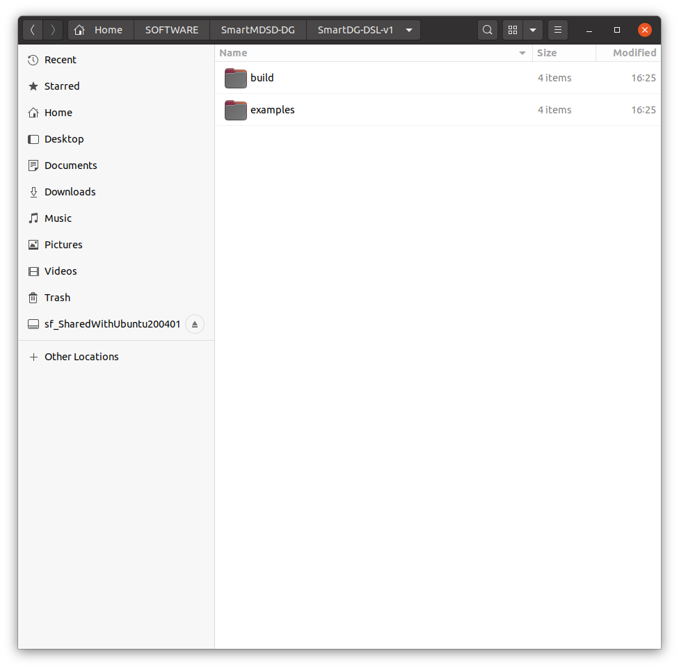
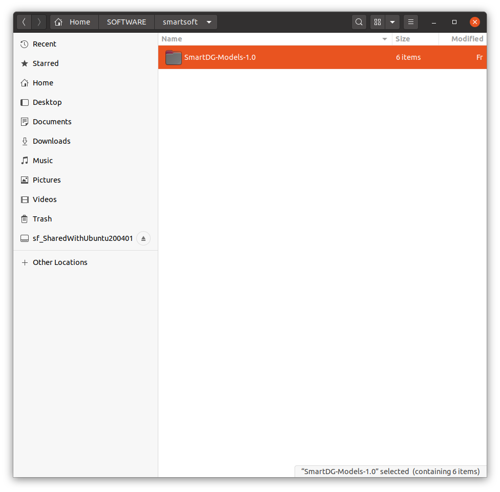
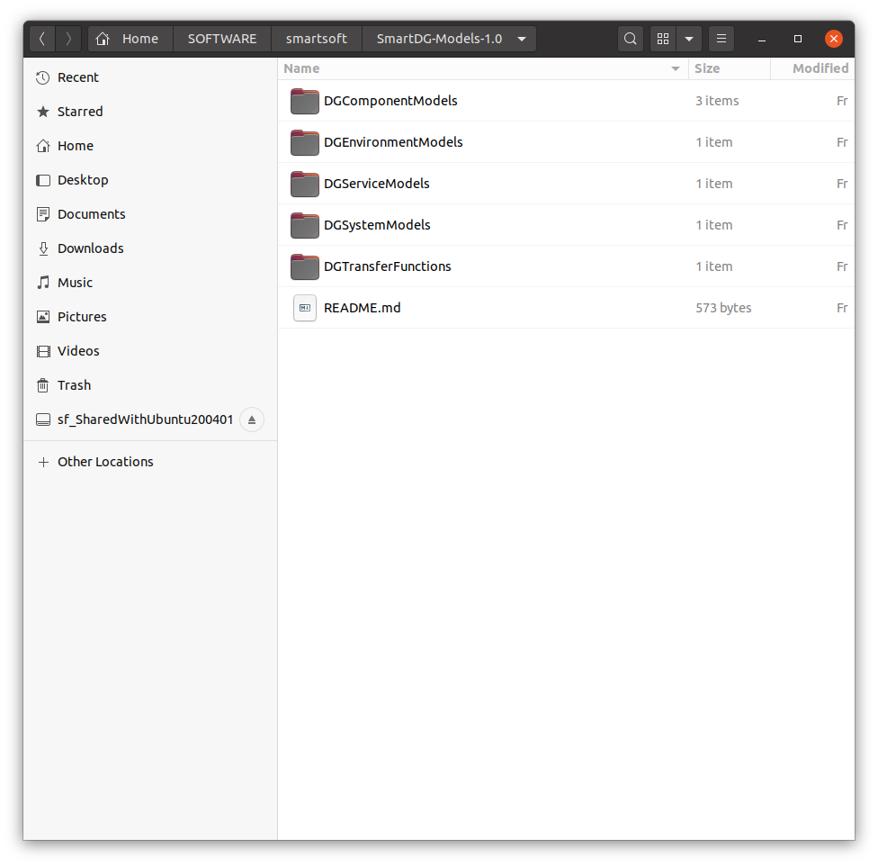

# SmartDG Tutorials
## Installing SmartDG DSLs On Eclipse

> :information_source: In case you are working with the [Official Virtual Machine and the SmartMDSD Toolchain](https://wiki.servicerobotik-ulm.de/tutorials:launching-vm-and-toolchain:start). See [This Tutorial](../03_01_Installing_SmartDG_DSLs_On_SmartMDSD_VirtualMachine/README.md) before going through the following steps.

#### Download and run the installation script on a generic machine
> :warning: Skip this step in case you are working with the [Official Virtual Machine and the SmartMDSD Toolchain](https://wiki.servicerobotik-ulm.de/tutorials:launching-vm-and-toolchain:start). 
> :warning: See [This Tutorial](../03_01_Installing_SmartDG_DSLs_On_SmartMDSD_VirtualMachine/README.md) before going any further in the current tutorial.

Download and copy the [Installing Script](Install_Eclipse_SmartMDSD-DG.sh) at a location where Eclipse-SmartMDSD with SmartDG features needs to be installed.



<details>
<p>
<summary>Install_Eclipse_SmartMDSD-DG.sh</summary>

```bash
#!/bin/bash
echo "####################################################################################"
echo "########################################## Install_Eclipse_SmartMDSD-DG START"
echo "####################################################################################"
echo "########################################## Smartsoft_Basic_Setup START"

SMARTSOFT_FOLDER="SOFTWARE/smartsoft"
SMARTSOFT_DIR="${HOME}/${SMARTSOFT_FOLDER}"
SMART_ROOT_ACE_VALUE=\$HOME/${SMARTSOFT_FOLDER}

echo "##################### SMARTSOFT_FOLDER    : $SMARTSOFT_FOLDER"
echo "##################### SMARTSOFT_DIR       : $SMARTSOFT_DIR"

if [ -d ${SMARTSOFT_DIR} ]
then
	echo "##################### ${SMARTSOFT_DIR} already exists !"	
else
	mkdir -p $SMARTSOFT_DIR
	echo "##################### ${SMARTSOFT_DIR} created !"	
fi
echo "##########################################"
echo "##################### SMART_ROOT_ACE_VALUE: $SMART_ROOT_ACE_VALUE"

if [[ "$SMART_ROOT_ACE" != "$SMARTSOFT_DIR" ]]; then
	echo "export SMART_ROOT_ACE=${SMART_ROOT_ACE_VALUE}" >> ~/.profile
	echo "##################### SMART_ROOT_ACE: Not Found... SETTING IT UP !"
	echo "##################### RESTART YOUR PC FOR THIS TO TAKE EFFECT!!  <-----------------<< Important !!"
	echo "########################################## Smartsoft_Basic_Setup DONE"	
	echo "####################################################################################"	
else
	echo "##################### SMART_ROOT_ACE: FOUND !"
	echo "##################### SMART_ROOT_ACE: ${SMART_ROOT_ACE}"
	echo "########################################## Smartsoft_Basic_Setup DONE"	
	echo "####################################################################################"

	echo "########################################## SMART_ROOT_ACE: ${SMART_ROOT_ACE}"
	TOOLCHAIN_NAME=SmartMDSD-DG
	echo "########################################## Installation target     : ${TOOLCHAIN_NAME}"
	ECLIPSE_BASE_VERSION=2020-09
	echo "########################################## Eclipse base version    : ${ECLIPSE_BASE_VERSION}"
	SMARTMDSD_REPO_URL="https://download.eclipse.org/smartmdsd/updates/releases/v3.15/${ECLIPSE_BASE_VERSION}"
	echo "########################################## SMARTMDSD_REPO_URL      : ${SMARTMDSD_REPO_URL}"
	SMARTMDSD_FEATURE_NAME="org.eclipse.smartmdsd.toolchain.source.feature.group"
	echo "########################################## SMARTMDSD_FEATURE_NAME  : ${SMARTMDSD_FEATURE_NAME}"
	SMARTDG_REPO_URL=https://github.com/Servicerobotics-Ulm/SmartDG-DSL
	SMARTDG_FEATURE_NAME=org.SmartDG.DSL.feature
	SMARTDG_RELEASE_NAME=v1.0
	SMARTDG_RELEASE_BUILD_FILENAME=SmartDG-DSL-v1.tar.gz
	
	SMARTDG_MODELS_REPO_URL=https://github.com/Servicerobotics-Ulm/SmartDG-Models
	SMARTDG_MODELS_NAME=SmartDG-Models
	SMARTDG_MODELS_RELEASE_NAME=v1.0
	SMARTDG_MODELS_RELEASE_FILENAME=SmartDG-Models-1.0.tar.gz

	echo "########################################## Downloading Eclipse Modeling Tools ${ECLIPSE_BASE_VERSION}"
	wget http://ftp-stud.fht-esslingen.de/pub/Mirrors/eclipse/technology/epp/downloads/release/${ECLIPSE_BASE_VERSION}/R/eclipse-modeling-${ECLIPSE_BASE_VERSION}-R-linux-gtk-x86_64.tar.gz
	echo "########################################## Extracting Eclipse Modeling Tools archive"
	tar -xzf eclipse-modeling-${ECLIPSE_BASE_VERSION}-R-linux-gtk-x86_64.tar.gz
	rm eclipse-modeling-${ECLIPSE_BASE_VERSION}-R-linux-gtk-x86_64.tar.gz
	mv eclipse $TOOLCHAIN_NAME
	echo "####################################################################################"	
	echo "########################################## Installing SmartMDSD Plugins"
	cd $TOOLCHAIN_NAME
	./eclipse -noSplash -application org.eclipse.equinox.p2.director -repository https://download.eclipse.org/releases/${ECLIPSE_BASE_VERSION} -repository ${SMARTMDSD_REPO_URL} -installIU ${SMARTMDSD_FEATURE_NAME}
	echo "########################################## SmartMDSD Toolchain is installed into the folder: $TOOLCHAIN_NAME"
	echo "####################################################################################"	
	SMARTDG_RELEASE_BUILD_URL=${SMARTDG_REPO_URL}/releases/download/${SMARTDG_RELEASE_NAME}/${SMARTDG_RELEASE_BUILD_FILENAME}
	echo "########################################## Installing SmartDG Plugins"
	echo "########################################## Downloading SmartDG feature | Name		: ${SMARTDG_FEATURE_NAME}"
	echo "########################################## Downloading SmartDG feature | Release	: ${SMARTDG_RELEASE_NAME}"
	echo "########################################## Downloading SmartDG feature | Repository	: ${SMARTDG_REPO_URL}"
	echo "########################################## Downloading SmartDG feature | File		: ${SMARTDG_RELEASE_BUILD_URL}"
	echo "########################################## Downloading SmartDG feature | Downloading	: Started"
	wget --no-check-certificate --content-disposition ${SMARTDG_RELEASE_BUILD_URL}
	echo "########################################## Downloading SmartDG feature | Downloading	: Finished"
	echo "########################################## Downloading SmartDG feature | Extracting	: ${SMARTDG_RELEASE_BUILD_FILENAME}"
	tar -xf ${SMARTDG_RELEASE_BUILD_FILENAME}
	rm ${SMARTDG_RELEASE_BUILD_FILENAME}
	echo "########################################## Downloading SmartDG feature | Extracted at	: $PWD"
	echo "########################################## Downloading SmartDG feature | Open Eclipse and Use"
	echo "########################################## Downloading SmartDG feature | Help >"
	echo "########################################## Downloading SmartDG feature | Install New Software >"
	echo "########################################## Downloading SmartDG feature | Add... >"
	echo "########################################## Downloading SmartDG feature | Local... >"
	echo "########################################## Downloading SmartDG feature | $PWD/build"
	echo "########################################## Downloading SmartDG feature | To add SmartDG feature to Eclipse"
	echo "####################################################################################"	
	SMARTDG_MODELS_RELEASE_BUILD_URL=${SMARTDG_MODELS_REPO_URL}/archive/${SMARTDG_RELEASE_NAME}.tar.gz
	echo "########################################## Downloading SmartDG Models"
	echo "########################################## Downloading SmartDG Models  | Name		: ${SMARTDG_MODELS_NAME}"
	echo "########################################## Downloading SmartDG Models  | Release	: ${SMARTDG_MODELS_RELEASE_NAME}"	
	echo "########################################## Downloading SmartDG Models  | Repository	: ${SMARTDG_MODELS_REPO_URL}"	
	echo "########################################## Downloading SmartDG Models  | File		: ${SMARTDG_MODELS_RELEASE_FILENAME}"	
	cd ${SMARTSOFT_DIR}
	echo "########################################## Downloading SmartDG Models  | Downloading	: Started"	
	wget --no-check-certificate --content-disposition ${SMARTDG_MODELS_RELEASE_BUILD_URL}
	echo "########################################## Downloading SmartDG Models  | Downloading	: Finished"
	echo "########################################## Downloading SmartDG Models  | Extracting	: ${SMARTDG_MODELS_RELEASE_FILENAME}"
	tar -xf ${SMARTDG_MODELS_RELEASE_FILENAME}
	rm ${SMARTDG_MODELS_RELEASE_FILENAME}
	echo "########################################## Downloading SmartDG Models | SmartDG-Models downloaded to ${SMARTSOFT_DIR}"
	echo "####################################################################################"	
	echo "########################################## Install_Eclipse_SmartMDSD-DG DONE"
fi
```
</p>
</details>

Open a new terminal window and run the [Installing Script](Install_Eclipse_SmartMDSD-DG.sh).

```bash 
bash Install_Eclipse_SmartMDSD-DG.sh
```

You will see the following message in case this is your first time running this script on a machine where SmartMDSD elements are not installed.

> :information_source: This will not be the case if you are starting with the [Official Virtual Machine and the SmartMDSD Toolchain](https://wiki.servicerobotik-ulm.de/tutorials:launching-vm-and-toolchain:start). See [This Tutorial](../03_01_Installing_SmartDG_DSLs_On_SmartMDSD_VirtualMachine/README.md) before going through the current tutorial.

:warning: Must restart your machine if you see the following message.



You will notice that smartsoft folder will appear at "HOME/SOFTWARE" if it was missing earlier. The system variable SMART_ROOT_ACE is now set to this folder location i.e. "HOME/SOFTWARE/smartsoft"



#### Download and run the installation script

Open a new terminal window and run the [Installing Script](Install_Eclipse_SmartMDSD-DG.sh) again.

```bash 
bash Install_Eclipse_SmartMDSD-DG.sh
```




The folder "SmartMDSD-DG" will appear in the folder where you ran the [Installing Script](Install_Eclipse_SmartMDSD-DG.sh). Note that in this case we are installing in the "HOME/SOFTWARE" folder... which is not a compulsion and the [Installing Script](Install_Eclipse_SmartMDSD-DG.sh) will generate folder "SmartMDSD-DG" in any other folder if one chooses to do so.



The folder "SmartMDSD-DG" should contain a folder named "SmartDG-DSL-vx" where x represents the SmartDG-DSL release number ( e.g. 1 for release one ).



Folder "SmartDG-DSL-vx" contains a folder "build" where install-able features and plugins for SmartDG functionality are imported.



The [Installing Script](Install_Eclipse_SmartMDSD-DG.sh) imports corresponding SmartDG-Models repository in the folder "SmartDG-Models-x.0" at "SMART_ROOT_ACE" i.e. at location "HOME/SOFTWARE/smartsoft"



SmartDG-Models repository contains models for SmartDG Tier-2 Environments, COmponents, Systems, Services and verified Transfer Functions provided by component manufacturers.



#### Install SmartDG-DSL on the newly installed Eclipse with SmartMDSD plugins

Open the folder "SmartMDSD-DG", click of the executable file named "eclipse" to launch the freshly installed Eclipse instance. This instance comes with SmartMDSD plugins preinstalled. 


