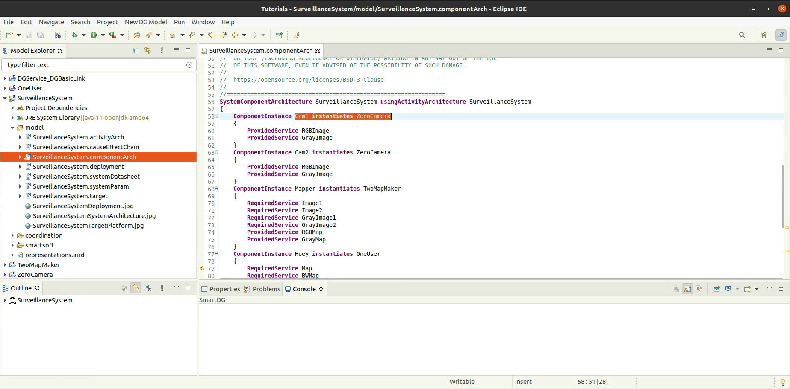
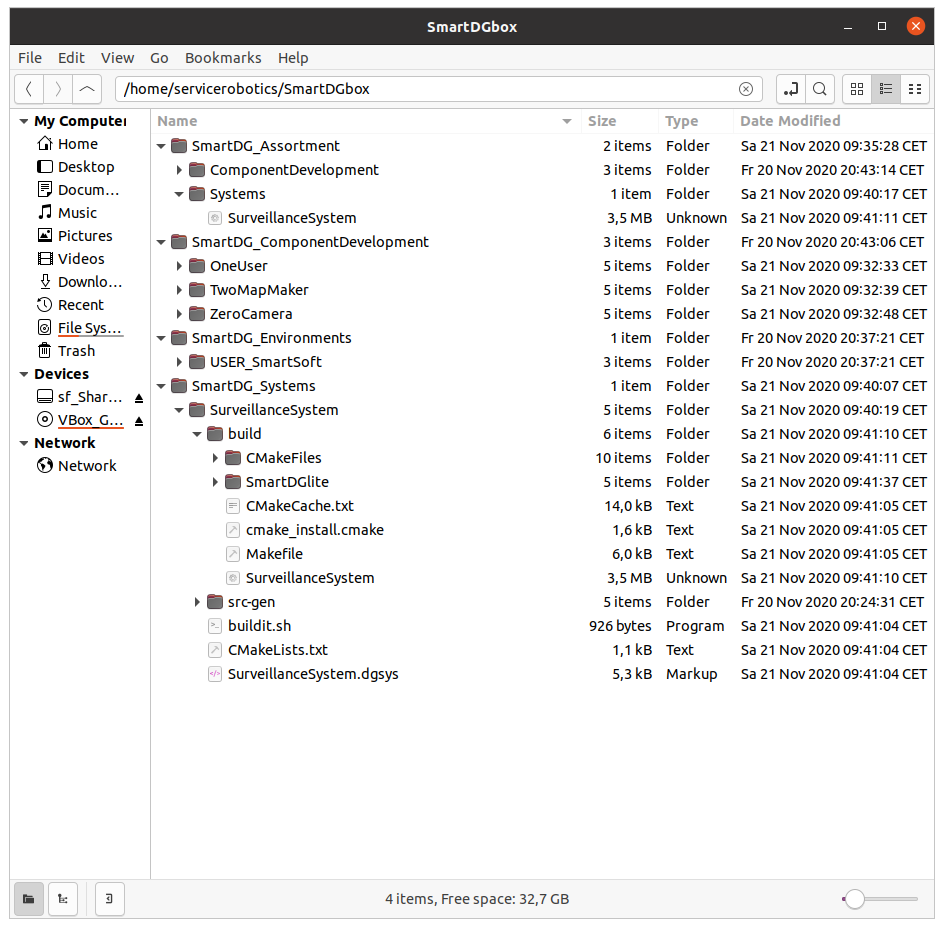

# SmartDG Tutorials
## Adding DG Model to System Project SmartMDSD

### Adding SmartDG Dependency Graph Model to SmartMDSD System Projects

> In an existing SmartMDSD system project.

> Component instances that are of components with the existing SmartDG component models.

> Add a new SmartDG model to the system project "SurveillanceSystem".

> The "dg" (Dependency Graph) and "de" (Tier-3 dependency environment) models will be generated. The "de" model is empty by default.

The "dg" default model will import the Tier-2 Dependency base environment from SMART_ROOT_ACE and make a Tier-3 User Environment model at HOME after it is built. SmartDG source code and the corresponding executable is generated at the HOME location. It is possible to replace HOME with a user-defined file path in the model. 

> "Unnamed" connectors and random placements for components in GUI are generated by the default "dg" model.

> Connectors (CS05, DF etc.) from the Tier-2 Environment model can be specified for specific Dependency connections.

> Specifying the placement of components in the GUI is essential for a clean SmartDG execution GUI.

> SmartDG models (source code and executables) are regenerated after every change in the model files.

> Interlinked windows are generated for "Component Views" and "Dependency Object" views.

> SmartDG Component View "Cam1" : An instance of Component "ZeroCamera" from Tier-3 User Environment. This uses generic transfer functions.

> SmartDG Component View "Cam2" : A second instance of Component "ZeroCamera" from Tier-3 User Environment. This too uses generic transfer functions.

> SmartDG Component View "Mapper":  An instance of Component "TwoMapMaker" from Tier-3 User Environment. This Transfer Functions provided by a Tier-2 Environment model.

> SmartDG Component View "Louie" : An instance of Component "OneUser" from Tier-3 User Environment. This uses generic transfer functions.

> SmartDG Component View "Huey" : Another two instances of Component "OneUser" from Tier-3 User Environment. Both of these uses generic functions as well.

> SmartDG Dependency Object View "DGSecurity" : Presents editable linked instances of Dependency Object "DGSecurity" across the complete system "SurveillanceSystem".

> The Dependency Object "DGSecurity" is defined in the Tier-2 Environment model.

> SmartDG Dependency Object View "DGPrivacy" : Presents editable linked instances of Dependency Object "DGPrivacy" across the complete system "SurveillanceSystem".

> The Dependency Object "DGPrivacy" is defined in the Tier-2 Environment model.

> "Component Views" are specific to a component's activity while the "Dependency Object" represents the system-wide activity of a particular Dependency Object.

> Changes in dependency objects across views are available for standalone (detached) or synced (attached) observation modes.

> The additional Download and Upload options give the user control over when to display the results of the most recent inward or outward Sync.

> Value of Dependency Object instance "DGPrivacy" in Output Port "RGBImage" of Component "Cam1" is changed by the most recent inward (Download) Sync.

> Solver and Transfer Function activity can be checked on the console.

> SmartDG source code and the corresponding executable is generated at the HOME location.

:information_source: Watch video [Adding SmartDG Dependency Graph Model to SmartMDSD System Projects](Adding_DG_Model_to_System_Project_SmartMDSD_A25.mp4)

