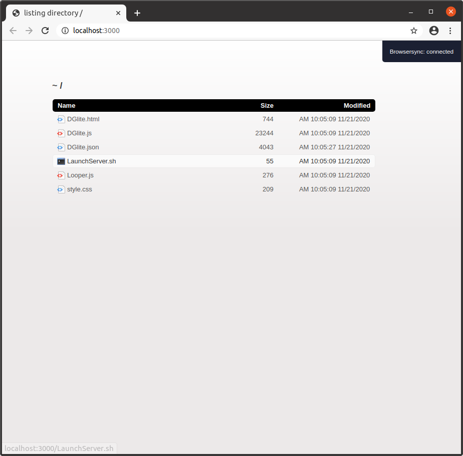
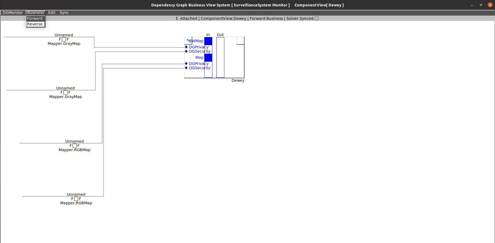

# SmartDG Tutorials
## Tutorial [Adding DG Model to System Project SmartMDSD](../03_04_Adding_DG_Model_to_System_Project_SmartMDSD/README.md) Using Litemode

### SmartDG Dependency Graph Model using SmartDGlite

> In addition to the SmartDG General Component and Dependency Object views, an additional system-wide multi-view representation (SmartDG Lite Mode) is generated by SmartDG.

> At present, the web-browser-based "SmartDG Lite Mode" is only available to observe (and not edit) the dependency object associations. This mode will be more functional in future releases.

> A SmartDG execution for a system model generates a folder named "SmartDGlite" in the directory of the executable file.

> To use the "SmartDG Lite Mode", Execute the "LaunchServer.sh" script from another terminal window. This is to launch the data-sync server.

> Note that this step is NOT REQUIRED to run the SmartDG system execution model in "General Mode". The user can avoid the steps given hereafter if "SmartDG Lite Mode" is not required.

> The Data-sync server launch is confirmed by the automatic launch of the browser window.

> The "SmartDG Lite Mode" can be launched by opening the "DGlite.html" file in any browser.

> An animated "Live" dot indicates that the "SmartDG Lite Mode" is synced with the General SmartDG system execution model.

> "SmartDG Lite Mode" provides greater functionality in terms of handling and observing the components and individual dependency links.

> Changes made in any of the General SmartDG component or dependency object views are reflected immediately in "SmartDG Lite Mode".

> "SmartDG Lite Mode" is in the experimental stage. Plans to make this the principal GUI are in the pipeline.

> Functionality to add/delete dependencies and change the values of dependency object instances in "SmartDG Lite Mode" is imagined as a future possibility.

:information_source: Watch video [SmartDG Dependency Graph Model using SmartDGlite](Tutorial_03_04_Using_Litemode_A27.mp4)

