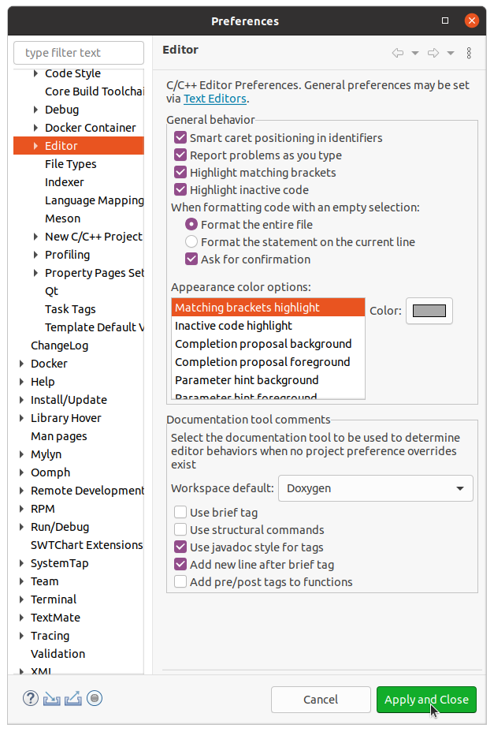
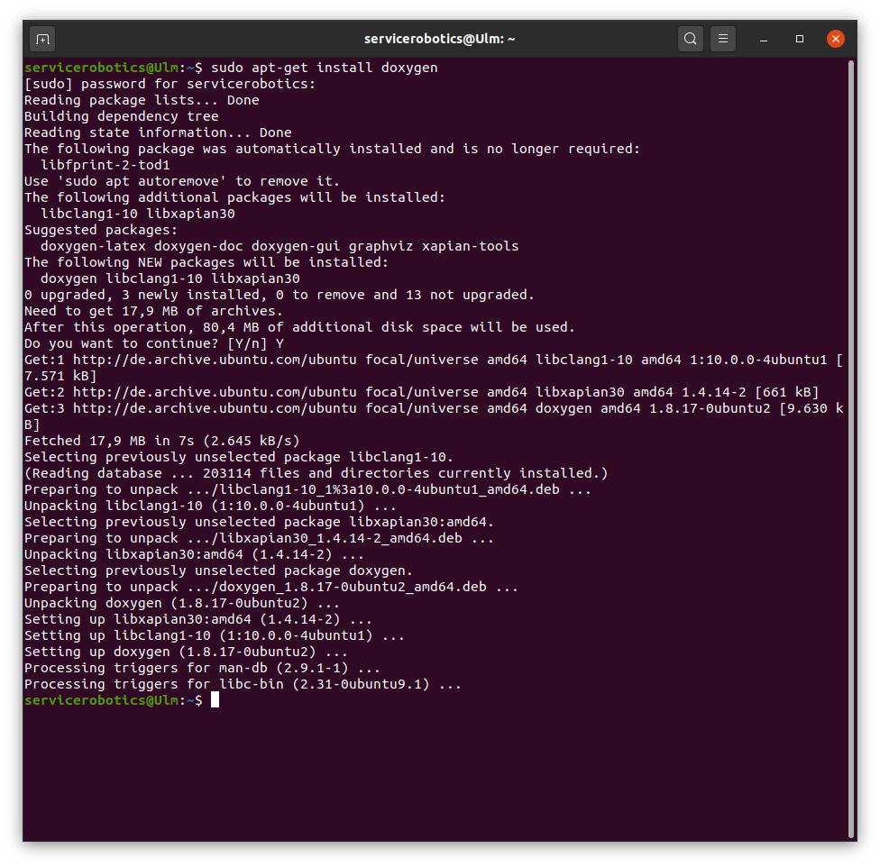

# SmartDG Tutorials
## SmartDG Developer EclipseProject Tips

### Steps to make an Eclipse project for SmartDG development

### A

### B

### C

### D

:information_source: Watch video [Steps to generate doxygen documentation](SmartDG_Developer_Doxygen_Tips_E.mp4)

